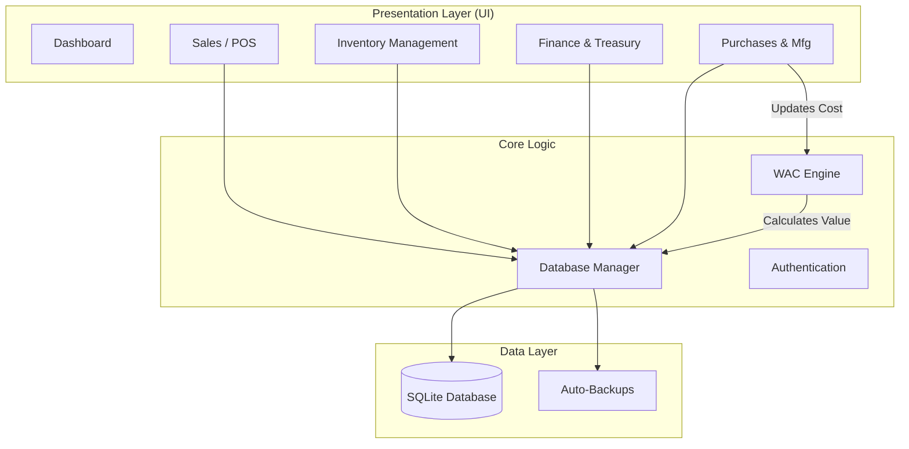

# 🏪 Historia POS

<div align="center">


**A Production-Grade Point of Sale & ERP System Built for Clothing Brands**

*Manufacturing Strategy • Inventory Management • Financial Tracking • Real-Time Analytics*

[Features](#-features) • [Installation](#-installation) • [Architecture](#-system-architecture) • [Usage](#-usage) • [Contributing](#-contributing)

</div>

---

## 📖 Overview

**Historia POS** is a comprehensive Point of Sale and Enterprise Resource Planning (ERP) system designed specifically for clothing manufacturers and retailers. Built with accounting-grade precision, it handles the complete business cycle from manufacturing to sales, ensuring financial integrity and operational excellence.

### 🎯 Built For

- 👔 Clothing Brands & Boutiques
- 🏭 Manufacturing Operations (External & Internal)
- 📊 Multi-location Retail Chains
- 💼 Small to Medium Enterprises (SMEs)

---

## ✨ Features

### 🏭 Manufacturing & Production
- **Integrated Manufacturing Mode**: Seamlessly switch between standard purchasing and manufacturing orders within the Purchase interface.
- **Cost Splitting**: Intelligently separates **Raw Materials** from **Labor/Factory** costs.
- **Auto-Unit Cost**: Automatically calculates the per-unit cost of finished goods based on total input costs and quantity.
- **Linked Transactions**: Automatically generates linked financial records for both material suppliers and manufacturing factories.

### 📦 Advanced Inventory Management
- **Weighted Average Cost (WAC)**: Accounting-grade algorithm with 2-decimal precision (Egyptian Piaster standard).
- **Real-Time Stock Updates**: Inventory is adjusted instantly upon sales, purchases, or returns.
- **Multi-Store Support**: Manage inventory across different physical store locations or warehouses.
- **Transfer Management**: Track stock movements between safes and stores.
- **Barcode Integration**: Full support for scanning items via barcode for rapid checkout and inventory lookups.

### 💰 Financial Integrity
- **Double-Entry Bookkeeping**: Ensures financial balance across all operations.
- **Treasury Management**: Track Cash Safes, Bank Transfers, and Deferred Payments.
- **Expense Categorization**: Detailed expense tracking (Vouchers) with categories for better financial insight.
- **Pending Invoices**: Track and manage accounts receivable (deferred sales) effectively.
- **Profit Accuracy**: Stores `cost_at_sale` to maintain historical profit data integrity even as future costs change.

### 🔒 Security & Reliability
- **SQL Injection Protection**: Fully parameterized queries throughout the system.
- **Input Validation**: Prevents logic errors (negative costs, invalid phone numbers).
- **Auto-Backup**: Automatic database backups on application exit to prevent data loss.
- **Role-Based Access**: Admin and Sales roles to restrict sensitive operations.

### 🔄 Complete ERP Cycle
- ✅ **Sales Point (POS)**: Fast, barcode-driven sales interface with receipt generation.
- ✅ **Purchases**: Manage suppliers, costs, and stock intake.
- ✅ **Returns**: Robust handling of Sales Returns and Purchase Returns.
- ✅ **Reports**: Comprehensive dashboard and PDF reports for Sales, Inventory, and Profit/Loss.

---

## 🏗️ System Architecture



---

## 🚀 Installation

### Prerequisites

- Python 3.8 or higher
- pip package manager

### Step 1: Clone the Repository

```bash
git clone https://github.com/Seif-rashwan/Historia-Inventory-System.git
cd Historia-Inventory-System
```

### Step 2: Create Virtual Environment (Recommended)

```bash
# Windows
python -m venv venv
venv\Scripts\activate

# Linux/Mac
python3 -m venv venv
source venv/bin/activate
```

### Step 3: Install Dependencies

```bash
pip install -r requirements.txt
```

### Step 4: Run the Application

```bash
python main.py
```

---

## 💻 Usage

### First Time Setup
1. Launch the application.
2. Login with default credentials (if applicable) or create an Admin account.
3. Define **Stores** and **Safes** (Treasury) in the settings or respective pages.

### 🏭 Processing a Manufacturing Order
1. Navigate to **Purchases** > **New Purchase Invoice**.
2. Toggle the **"External Manufacturing" (تصنيع خارجي)** switch at the top.
3. Select the **Raw Material Supplier** and **Factory Supplier**.
4. Enter the **Material Cost** and **Labor Cost**.
5. Add the finished goods (items) to the cart and specify quantities.
6. The system auto-calculates the **Unit Cost**.
7. Click **Save** to update stock and record financial transactions for both suppliers.

### 🛒 Processing a Sale
1. Go to **Sales (POS)** > **New Invoice**.
2. Scan a barcode or search for an item.
3. Adjust quantities.
4. Select Payment Method (Cash/Visa/Deferred).
5. Click **Save (F5)** to complete the transaction.

---

## 📁 Project Structure

```
InventoryApp/
│
├── main.py                 # Application Entry Point
├── requirements.txt        # Python Dependencies
├── app/
│   ├── database.py         # Database Manager & Schema Definitions
│   ├── config.py           # Configuration Constants
│   ├── utils.py            # Utility Functions
│   │
│   └── ui/                 # User Interface Modules
│       ├── sales/          # POS, Returns, History, Customers
│       ├── purchases/      # Purchase Invoices, Returns, Manufacturing Logic
│       ├── inventory/      # Stock, Transfers, Suppliers, Imports
│       ├── finance/        # Safes, Vouchers, Reports, Pending Invoices
│       └── ...
│
└── data/                   # Database File (inventory.db)
```

---

## 🤝 Contributing

Contributions are welcome! Please follow these steps:

1. Fork the repository.
2. Create a feature branch (`git checkout -b feature/AmazingFeature`).
3. Commit your changes (`git commit -m 'Add AmazingFeature'`).
4. Push to the branch (`git push origin feature/AmazingFeature`).
5. Open a Pull Request.

---

## 📜 License

This project is licensed under the MIT License - see the [LICENSE](LICENSE) file for details.

---

<div align="center">

**⭐ Star this repository if you find it helpful!**

Made with ❤️ by **Seif Rashwan**

</div>
